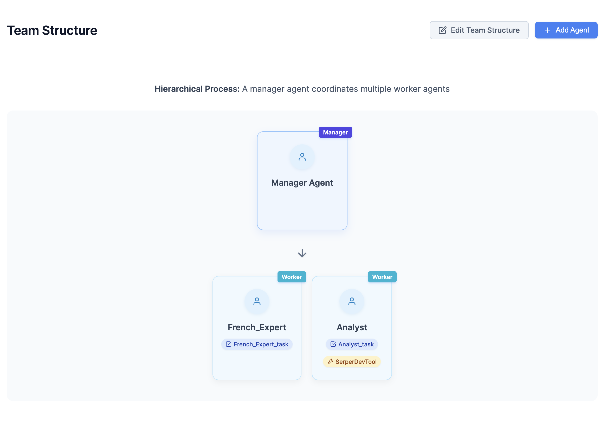
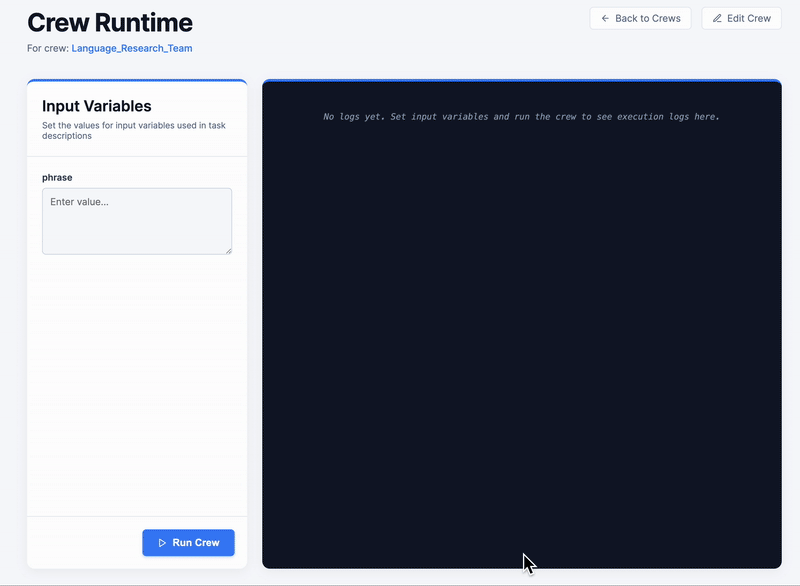

# CrewAI UI Master

A powerful interface for creating and managing AI agents to solve complex problems.

## Preview

Create some complex agents and team structures to perform tasks



Run and monitor their performance.



## Prerequisites

- Python 3.12 (please only run in this version for now)
- Node.js and npm
- OpenAI_API_KEY
- SERPER_API_KEY

## Environment Setup

1. Create a `.env` file in the root directory with the following:

# env
OPENAI_API_KEY
SERPER_API_KEY

## Installation

### Python Dependencies

Install the required Python packages:

```bash
virtualenv -p python3.12 venv
source venv/bin/activate
```

```bash
python3.12 -m pip install -r requirements.txt
```

### Frontend Dependencies

Install Node.js dependencies:

```bash
npm install
```

## Development

Start the development server:

```bash
# Standard start
npm run dev

# Start and open in browser automatically
npm run dev -- --open
```

## Features

- Create and manage AI agents with custom roles and capabilities
- Orchestrate multiple agents to work together on complex tasks
- Intuitive UI for monitoring and controlling agent activities

## Usage

After starting the development server, navigate to `http://localhost:3000` in your browser to access the CrewAI UI.

## Contributing

Contributions are welcome! Please feel free to submit a Pull Request.

